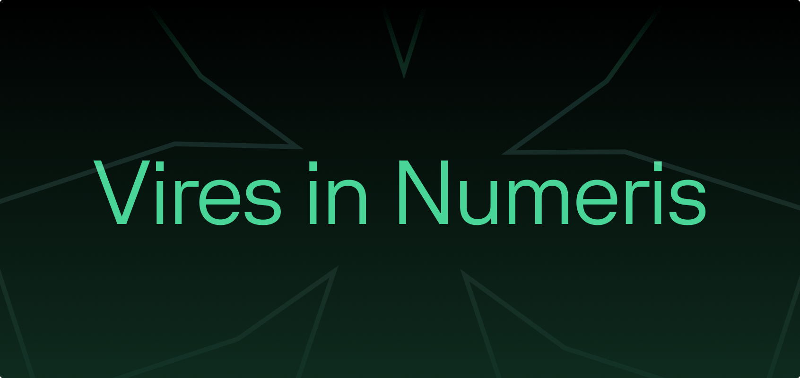

# 👋 Hi there

We're Valera. ***We make payment tech.*** Or in more words, we're an early-stage payment technology firm developing cutting edge hardware and software using Bitcoin, the internet's native currency. Est. 722,913.

From daily coffees ☕ to corporate treasuries 💼, we help people ~~trust~~ **verify** their money. We support the 1.7 billion that banks rejected, and we help the 7.97 billion protect themselves against cancerous inflation.

## 🤖 Our tech

We take pride in our engineering - both software and hardware.

- We're avid Rustaceans and use Rust everywhere from our Lightning nodes to our payment hardware.
- Our first-party apps are written native for their respective platforms, using Swift and Kotlin.
- Web apps are written in SvelteKit and TypeScript.
- Nearly all of our code is open source. Anything that runs on a device we don't own will always use open source software exclusively. Our server-side tech is closed source, however.
- Customer privacy is our top priority, and we self-host all our server-side tech. Any data you send to us is exclusively to us, not to a CDN or other third-party.

## 🤝 Looking for a job?

We're always looking for talented engineers to join our team. If you're interested, please reach out to us at [jobs@valera.co](mailto:jobs@valera.co).

---

Currently, we're looking for:

- [ ] Swift (Apple ecosystem) engineers
- [ ] Kotlin (Android) engineers
- [ ] Rust engineers [embedded, backend]
- [ ] SvelteKit (web) engineers [frontend]
- [ ] Hardware engineers

Please note that we're not looking for any other roles at this time!

If you have experience working on Bitcoin, that's a massive plus! And **bitcoin-only**, we don't do "crypto" here.
